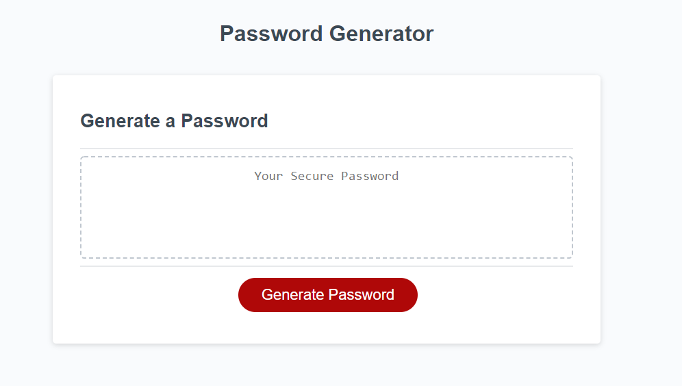
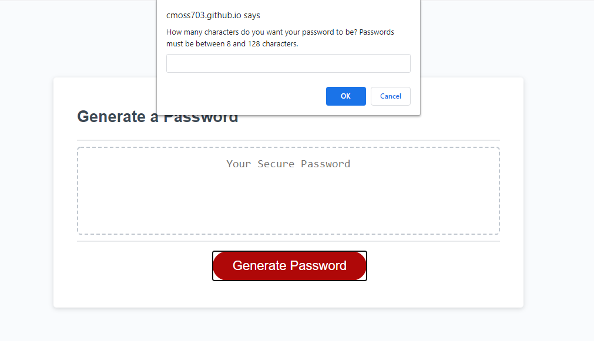
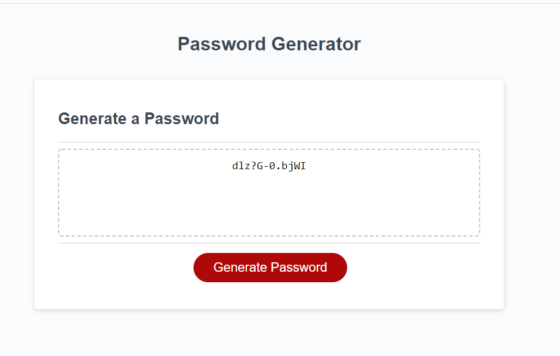

# PASSWORD GENERATOR

## DESCRIPTION

This webpage was designed to generate a random password based on user-defined criteria. 

When the "Generate Password" button is clicked, a series of prompts are called to ask the user how many characters between 8 and 128 they want the password to use, and which types of characters to include in the password. 

A string of characters with the chosen criteria is then returned to the user, this is your new password!

## WHAT WAS DONE?

The Javascript document is where most of the work was done. 

I declared many of the variables needed in the top of the script, including a few empty strings and arrays to be filled in later. 

My thought process was to create different arrays of specific types of characters (lowercase letters, uppercase letters, numbers, and special characters). When the user declares that they want to use a certain type of character, the respective array is pushed (in this case concatenated) into a new array that includes only the types of character the user wants to use. 

I then used a for loop to generate random numbers based on how many values are in the array. The number of values that are generated correlate with the number of characters the user specifies, which are then put into a new array. This array is converted into a string and returned to the user as a new, randomly generated password.

## DEPLOYED!

This project was successfully deployed. Need proof? Click the links below to give it a try.

## PROOF

Here are some screenshots of my webpage in action:

